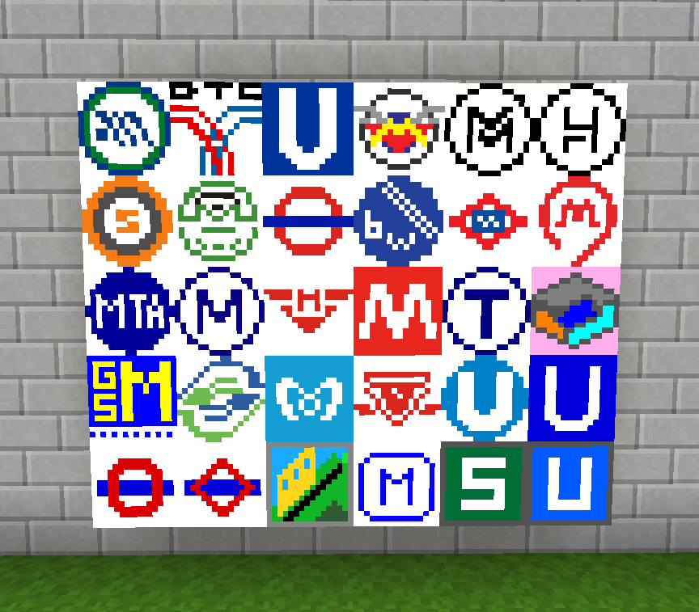

==========
metrosigns
==========

This is a mod for `Minetest <https://www.minetest.net/>`__, providing an extended selection of signs for use in your train and metro networks.

.. image:: screenshots/example1.png
  :alt: Train platform

The mod includes:

* Semi-realistic signage from twenty major cities - the London Underground, the Paris Metro, the New York Subway - and more!
* Line number signs from 1-99, using the colour scheme established by `advtrains_subwayblocks <https://git.gpcf.eu/?p=advtrains_subwayblocks.git>`__
* Platform signs from 1-99
* A sign-writing machine (for use in survival mode)
* Nodes from `advtrains_subwayblocks <https://git.gpcf.eu/?p=advtrains_subwayblocks.git>`__ and `trainblocks <https://github.com/maxhipp/trainblocks_bc>`__, if those mods aren't already loaded
* Over 1300 items in total

The mod includes and builds on material from the following mods:

* `advtrains_subwayblocks <https://git.gpcf.eu/?p=advtrains_subwayblocks.git>`__ by gpcf/orwell
* `trainblocks <https://github.com/maxhipp/trainblocks_bc>`__ by Maxx
* `roads <https://cheapiesystems.com/git/roads/>`__ by cheapie

Licences
--------

The sign writer and ink cartridges (code and textures) are licenced under CC-BY-SA 3.0 Unported.

Everything else is licenced under GNU Affero GPL.

Authors
-------

Code and textures: `A S Lewis <https://github.com/axcore/>`__.

Code and texture contributors: gpcf/orwell, Max, cheapie

Dependencies
------------

There are no dependencies. **NB This is currently not true - see below.**

Optional dependencies
---------------------

If default and `basic_materials <https://gitlab.com/VanessaE/basic_materials>`__ are loaded, the sign writing machine and ink cartridges are craftable.

If signs_api from `display_modpack <https://github.com/pyrollo/display_modpack>`__ is loaded, you can create signs with customisable text.

Downloads
---------

The latest release is available `here <https://github.com/axcore/metrosigns>`__.

Screenshots
-----------

.. image:: screenshots/example2.png
  :alt: Sugn-writing machine

.. image:: screenshots/example4.png
  :alt: Various line signs

.. image:: screenshots/example5.png
  :alt: Various platform signs

Known bugs
----------
- Minetest will not (or cannot) read settingtypes.txt correctly. Until this is resolved, all nodes are available by default
- The sign-writing machine will not display more than one page of signs at a time
- signs_api from display_modpack should be an optional dependency, but the minetest game won't start (sometimes) if signs_api is not loaded
- Sounds for the sign-writing machine are commented out because I don't know how to make them work
